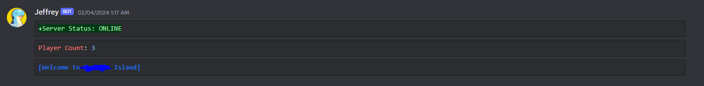

# PalworldServerBOT
A simple discord BOT I made to check the server status and player information for my Palworld Server.

 **Available commands:**  

**!status** - *shows the status of the server, player count, and the server message*  

**!onlineplayers** - *lists the players online*  

**!hello** - *says hello*  

**!roll dice** - *rolls a dice*

